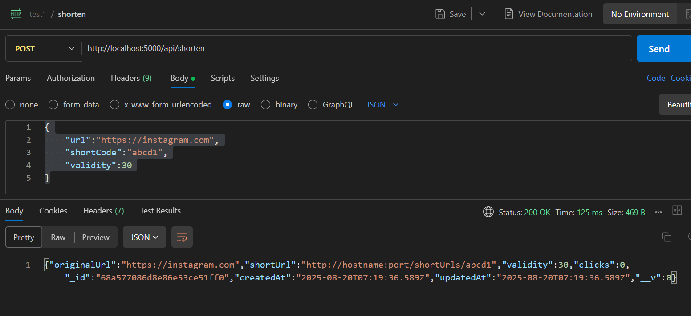

# Campus Hiring Evaluation - Roll Number: 2215006

A comprehensive HTTP URL Shortener Microservice with integrated Logging Middleware, built for Campus Hiring Backend Evaluation.

A simple and robust HTTP URL Shortener microservice with analytics capabilities, built with extensive logging integration.

##   API Output Examples

### Output-1: POST Request Response
*Request:* POST http://localhost:3000/shorturls
json
{
    "url": "https://very-very-very-long-and-descriptive-subdomain-that-goes-on-and-on.somedomain.com/additional/directory/levels/for/more/length/really-log-sub-domain/a-really-log-page",
    "validity": 30,
    "shortcode": "abcd1"
}

*Response:*

Expected Response (201 Created):
json
{
    "shortLink": "http://localhost:3000/abcd1",
    "expiry": "2025-08-20T08:00:00.000Z"
}

    "isActive": true
}
